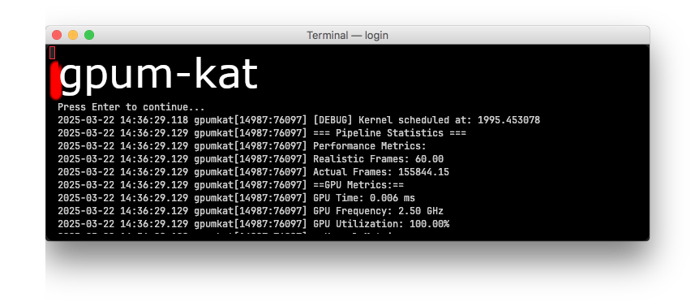
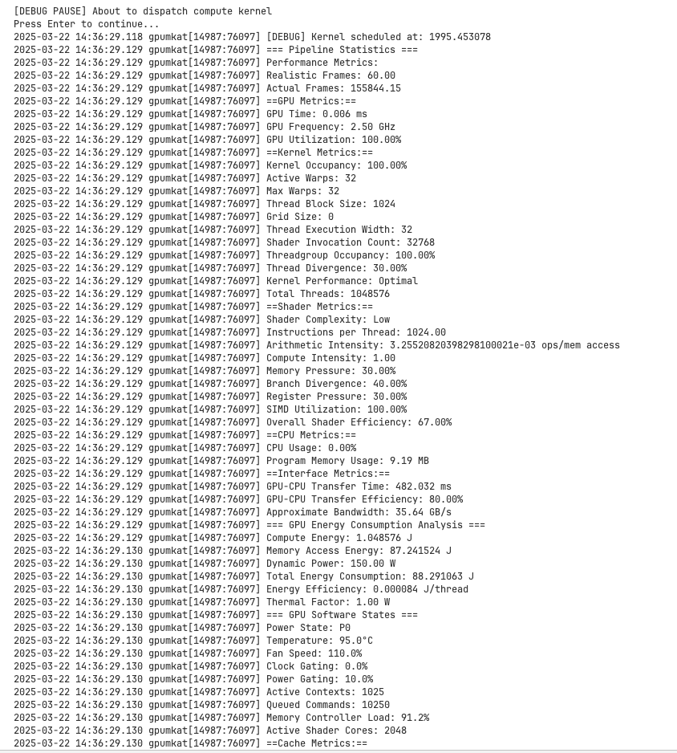

# Gpumkat



a GPU kernel analysis tool for macOS Metal with many features ranging from analyzing performance to energy consumption, cache hit rates, interface metrics, gpu software states, shader optimization recommendations, stack traces, recording timelines and traces and more.

## Requirements:

- any platform that supports metal
- metal api
- xcode
- homebrew 
- json-c 0.17 (installed with homebrew)
- curl 

## Installation

To install gpumkat run this command.

```sh
curl -L -o gpumkat.tar.gz https://github.com/MetalLikeCuda/osxiec/releases/download/%s/gpumkat.tar.gz && tar -xvzf gpumkat.tar.gz && cd gpumkat && sudo sh install.sh
```

replace %s with the latest version

## Usage

```sh
gpumkat <path_to_config_file>
```

---
### Commands you can use

**To update**

```sh
gpumkat -update
```

**To add plugins**

```sh
gpumkat -add-plugin <path_to_plugin>
```

**To remove plugins**

```sh
gpumkat -remove-plugin <path_to_plugin>
```

**To run a core image shader**

```sh
gpumkat <path_to_config_file> -ci <shader_name> 
```

**To get help**

```sh
gpumkat -help
```

**To get version information**

```sh
gpumkat --version
```

**To run tests**
```sh
gpumkat -test <path_to_test_config_file>
```

**To run lsp server**

```sh
gpumkat -lsp
```

## Examples

More examples can be seen in the examples folder

### How lsp looks


### Example config:

```json
{
  "metallib_path": "default.metallib",
  "function_name": "compute_shader",
  "pipeline_type": "compute",
  "logging": {
    "enabled": true,
    "log_file_path": "gpumkat_profiler.log",
    "log_level": 3,
    "log_timestamps": true
  },
  "debug": {
    "enabled": true,
    "print_variables": true,
    "step_by_step": true,
    "break_before_dispatch": true,
    "verbosity_level": 2,
    "breakpoints": [
      {
        "condition": "BeforeDispatch",
        "description": "After buffer initialization"
      }
    ],
    "error_handling": {
      "catch_warnings": true,
      "catch_memory_errors": true,
      "catch_shader_errors": true,
      "catch_validation_errors": true,
      "break_on_error": false,
      "max_error_count": 100,
      "min_severity": 1
    },
    "timeline": {
      "enabled": true,
      "output_file": "gpumkat_timeline2.json",
      "track_buffers": true,
      "track_shaders": true,
      "track_performance": true,
      "max_events": 1000
    },
    "low_end_gpu": {
      "enabled": true,
      "compute": {
        "processing_units_availability": 0.6,
        "clock_speed_reduction": 0.4,
        "compute_unit_failures": 2
      },
      "memory": {
        "bandwidth_reduction": 0.6,
        "latency_multiplier": 3.0,
        "available_memory": 536870912,
        "memory_error_rate": 0.02
      },
      "thermal": {
        "thermal_throttling_threshold": 85.0,
        "power_limit": 50.0,
        "enable_thermal_simulation": true
      },
      "logging": {
        "detailed_logging": true,
        "log_file_path": "/tmp/low_end_gpu_simulation.log"
      },
      "rendering": {
        "fillrate_reduction": 0.2,
        "texture_quality_reduction": 0.3,
        "reduce_draw_distance": true,
        "draw_distance_factor": 0.5
      }
    },
    "async_debug": {
      "enable_async_tracking": true,
      "log_command_status": true,
      "detect_long_running_commands": true,
      "long_command_threshold": 2.5,
      "generate_async_timeline": true
    },
    "thread_control": {
      "enable_thread_debugging": true,
      "dispatch_mode": 3,
      "log_thread_execution": true,
      "validate_thread_access": true,
      "simulate_thread_failures": true,
      "thread_failure_rate": 0.05,
      "custom_thread_group_size": [32, 1, 1],
      "custom_grid_size": [1024, 1, 1],
      "thread_order_file": "custom_thread_order.txt"
    }
  },
  "buffers": [
    {
      "name": "inputBuffer",
      "size": 1024,
      "type": "float",
      "contents": [1.0, 2.0, 3.0, 4.0, 5.0]
    },
    {
      "name": "outputBuffer",
      "size": 1024,
      "type": "float",
      "contents": []
    }
  ],
  "image_buffers": [
    {
      "name": "inputImage",
      "image_path": "/path/to/image.png",
      "width": 0,
      "height": 0,
      "type": "float"
    }
  ]
}
```
### Example test config
```json
{
	"name": "GPU Kernel Test Suite",
	"description": "Comprehensive test suite for GPU compute kernels",
	"metallib_path": "test.metallib",
	"stop_on_failure": false,
	"verbose_output": true,
	"generate_report": true,
	"report_path": "gpu_test_report.html",
	"test_cases": [
		{
			"name": "vector_addition_basic",
			"description": "Test basic vector addition with simple inputs",
			"pipeline_type": "compute",
			"shader_function": "vector_add",
			"skip": false,
			"timeout_ms": 5000,
			"max_execution_time_ms": 100,
			"max_memory_usage_mb": 50,
			"input_buffers": [
				{
					"name": "input_a",
					"size": 1024,
					"data": [
						1.0,
						2.0,
						3.0,
						4.0,
						5.0
					]
				},
				{
					"name": "input_b",
					"size": 1024,
					"data": [
						2.0,
						3.0,
						4.0,
						5.0,
						6.0
					]
				},
				{
					"name": "output",
					"size": 1024,
					"data": []
				}
			],
			"assertions": [
				{
					"type": "buffer_equals",
					"description": "First element should be 3.0",
					"buffer_name": "output",
					"index": 0,
					"expected": 3.0
				},
				{
					"type": "buffer_equals",
					"description": "Second element should be 5.0",
					"buffer_name": "output",
					"index": 1,
					"expected": 5.0
				},
				{
					"type": "buffer_near",
					"description": "Third element should be approximately 7.0",
					"buffer_name": "output",
					"index": 2,
					"expected": 7.0,
					"tolerance": 0.001
				},
				{
					"type": "performance_lt",
					"description": "Execution should complete within 50ms",
					"threshold_ms": 50.0
				}
			]
		}
]
```
### Example kernel:

```c
#include <metal_stdlib>
using namespace metal;

kernel void compute_shader(const device float *input [[buffer(0)]],
                           device float *output [[buffer(1)]],
                           uint index [[thread_position_in_grid]]) {
    output[index] = input[index] * 2.0;
}
```

### Example Logs:


## Building

You can build gpumkat using cmake with the following command:
```sh
mkdir build && cd build && cmake -S .. -B . -G "Ninja" && ninja
```

### Notes:

Other shaders you can use are located in the list of shaders: https://github.com/MetalLikeCuda/list_of_metal_shaders.md

Some things like temperature are simulated so it's better to just use instruments if you want very low level hardware specific data, though for normal debugging this should be better.

Use renderer pipeline type for rendering pipelines.
