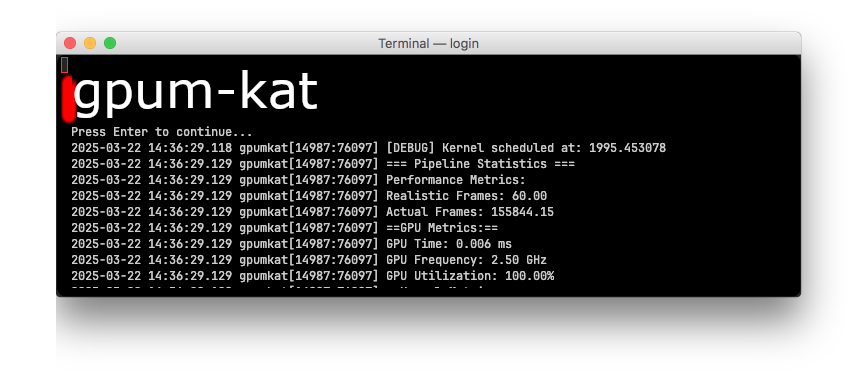
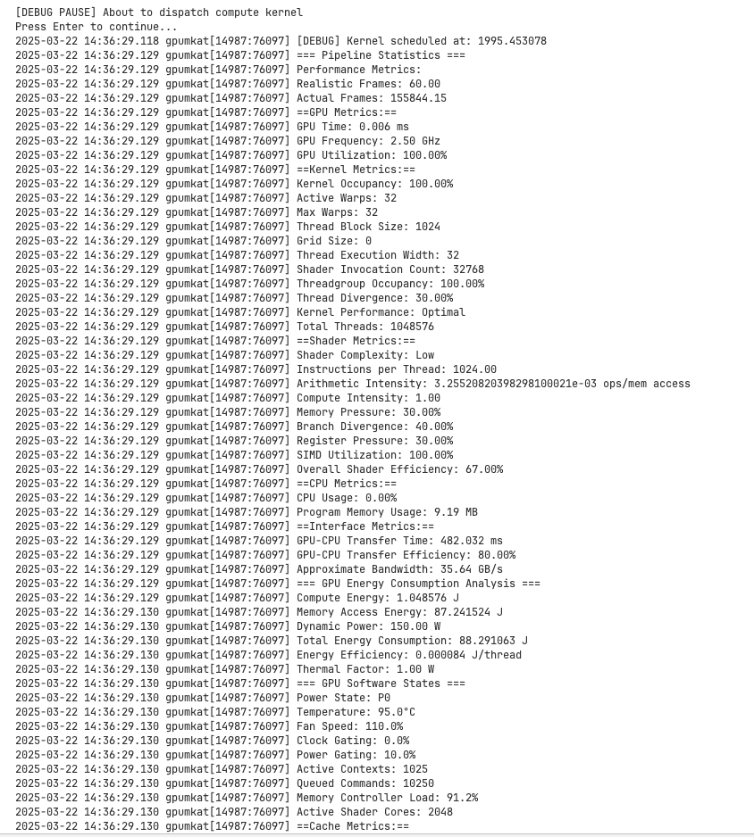

# Gpumkat



a GPU kernel analysis tool for macOS Metal with many features ranging from analyzing performance, cache hit rates, interface metrics, gpu software states, shader optimization recommendations, stack traces, recording timelines, traces and more.

## Requirements:

- arm MacOS and M series chip
- any platform that supports metal
- metal api
- xcode
- homebrew 
- json-c 0.18 (installed with homebrew)
- curl 

## Installation

To install gpumkat run this command.

```sh
git clone https://github.com/MetalLikeCuda/gpumkat && cd gpumkat && sudo sh install.sh
```

## Usage

```sh
gpumkat <path_to_config_file>
```

---
### Commands you can use

**To update**

```sh
gpumkat -update
```

**To add plugins**

```sh
gpumkat -add-plugin <path_to_plugin>
```

**To remove plugins**

```sh
gpumkat -remove-plugin <path_to_plugin>
```

**To get help**

```sh
gpumkat -help
```

**To get version information**

```sh
gpumkat --version
```

**To run tests**
```sh
gpumkat -test <path_to_test_config_file>
```

**To run lsp server**

```sh
gpumkat -lsp
```

## Examples

More examples can be seen in the examples folder

### Example config:

```json
{
    "metallib_path": "default.metallib",
    "function_name": "texture_invert",
    "logging": {
        "enabled": true,
        "log_file_path": "gpumkat_profiler.log",
        "log_level": 3,
        "log_timestamps": true
    },
    "debug": {
        "enabled": true,
        "print_variables": true,
        "step_by_step": true,
        "break_before_dispatch": false,
        "verbosity_level": 2,
        "breakpoints": [],
        "error_handling": {
            "catch_warnings": true,
            "catch_memory_errors": true,
            "catch_shader_errors": true,
            "catch_validation_errors": true,
            "break_on_error": false,
            "max_error_count": 100,
            "min_severity": 1
        },
        "timeline": {
            "enabled": false,
            "output_file": "gpumkat_timeline2.json",
            "track_buffers": true,
            "track_shaders": true,
            "track_performance": true,
            "max_events": 1000
        },
        "low_end_gpu": {
            "enabled": false,
            "compute": {
                "processing_units_availability": 0.6,
                "clock_speed_reduction": 0.4,
                "compute_unit_failures": 2
            },
            "memory": {
                "bandwidth_reduction": 0.6,
                "latency_multiplier": 3.0,
                "available_memory": 536870912,
                "memory_error_rate": 0.02
            },
            "thermal": {
                "thermal_throttling_threshold": 85.0,
                "power_limit": 50.0,
                "enable_thermal_simulation": true
            },
            "logging": {
                "detailed_logging": true,
                "log_file_path": "low_end_gpu_simulation.log"
            }
        },
        "async_debug": {
            "enable_async_tracking": false,
            "log_command_status": false,
            "detect_long_running_commands": false,
            "long_command_threshold": 2.5,
            "generate_async_timeline": false
        },
        "thread_control": {
            "enable_thread_debugging": false,
            "dispatch_mode": 0,
            "log_thread_execution": false,
            "validate_thread_access": false,
            "simulate_thread_failures": false,
            "thread_failure_rate": 0.0,
            "custom_thread_group_size": [
                16,
                16,
                1
            ],
            "custom_grid_size": [
                512,
                512,
                1
            ],
            "thread_order_file": ""
        }
    },
    "buffers": [
        {
            "name": "input_a",
            "size": 1024,
            "type": "float",
            "contents": [
                1.0,
                2.0,
                3.0,
                4.0,
                5.0
            ]
        },
        {
            "name": "input_b",
            "size": 1024,
            "type": "float",
            "contents": [
                2.0,
                3.0,
                4.0,
                5.0,
                6.0
            ]
        },
        {
            "name": "output",
            "size": 1024,
            "type": "float",
            "contents": []
        }
    ],
    "image_buffers": [
        {
            "name": "inputImage",
            "image_path": "image.png",
            "width": 0,
            "height": 0,
            "pixel_format": "RGBA8Unorm",
            "mipmaps": false,
            "texture_usage": [
                "shader_read"
            ],
            "backend": "texture",
            "bind": {
                "as": "texture",
                "index": 0
            }
        },
        {
            "name": "outputImage",
            "width": 512,
            "height": 512,
            "pixel_format": "RGBA8Unorm",
            "mipmaps": false,
            "texture_usage": [
                "shader_write"
            ],
            "backend": "texture",
            "bind": {
                "as": "texture",
                "index": 1
            }
        }
    ]
}
```

### Example Logs:


## Building

You can build gpumkat using cmake with the following command:
```sh
mkdir build && cd build && cmake -S .. -B . -G "Ninja" && ninja
```

### Notes:

Other shaders you can use are located in the list of shaders: https://github.com/MetalLikeCuda/list_of_metal_shaders.md

Some things like temperature are approximated so it's better to just use instruments if you want very low level hardware specific data, though for normal debugging this should be better.

You can still use the old image buffer logic using the old style config.
